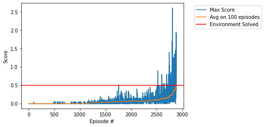

# DRL-ND-Project_3

## Description

In this project I trained a maddpg agent to solve the unity environment "Tennis" which consist of two agents that try to control rackets to bounce a ball over a net, the states and actions in the environment consists as follows:

* Vector Observation space: 8 variables corresponding to the position and velocity of the ball and racket.
* Vector Action space: (Continuous) Size of 2. corresponding to movement toward (or away from) the net, and jumping
* Visual Observations: None

The task is episodic, and if an agent hits the ball over the net, it receives a reward of +0.1. If an agent lets a ball hit the ground or hits the ball out of bounds, it receives a reward of -0.01, and in order to solve the environment, the agents must get an average score of +0.5 (over 100 consecutive episodes, after taking the maximum over both agents)

## Getting Started

To train or test the sac_agent.

1. Clone this repo.
2. Create a virtual environment.
2. Over the environment run `pip install -r requirements.txt`

## Instructions

All the code to train or to test the sac agent is contained inside the **'Continuous_Control.ipynb'** file and following the cell instructions you can train an agent from scratch or test it loading the saved model.

## Results

The agent was able to achive a reward of +0.5 after 2883 episodes. 

## Citations
The code of this repo is based/inspired from the github projects: 

/Deep-Reinforcement-Learning-Hands-On from **@PacktPublishing**
/Deep-Reinforcement-Learning-Algorithms from **@rafael1s** 